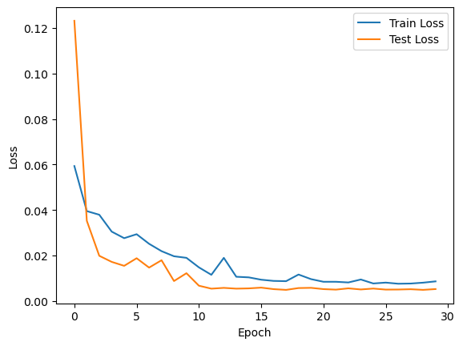

# Document Alignment with HomographyNet

> **Take-home test assignment for a job interview** (computer vision). The final solution is at the top level; the development history is in [`drafts/`](drafts).

A deep learning model that **straightens photos of paper sheets**: it predicts the homography that maps a skewed, perspective-distorted photo of a sheet to a flat, front-facing view.

## Problem

Classic approaches (edge/corner detection + `findHomography`) were unreliable on my photos, and no public dataset of paper sheets with ground-truth homographies was available. So I:

1. **Built my own dataset** of ~1,200 images with the 8 homography parameters for each image (`homography_data.csv`).
2. Tried fine-tuning a YOLO-based model, which did not converge well on this task.
3. Switched to a **regression network on top of a pretrained ResNet-18**, which gave stable results.

## Model

```
Input image (256×256)
   └─ ResNet-18 backbone (ImageNet weights, classifier head removed) → 512 features
        └─ FC 512 → 256 → ReLU → FC 256 → 128 → ReLU → FC 128 → 8
             └─ 8 homography parameters (h33 fixed to 1)
```

| Setting | Value |
|---|---|
| Targets | 8 homography parameters, standardised with `StandardScaler`; rescaled to the 256×256 input |
| Loss | Smooth L1 (Huber) |
| Optimizer | AdamW, lr = 1e-3, weight decay = 1e-5, StepLR scheduler |
| Split | 80 / 20 train / test |
| Epochs | 30 |

## Results

| | Smooth L1 loss (standardised params) |
|---|---|
| Train | 0.0086 |
| **Test** | **0.0052** |



At inference, the predicted parameters are inverse-transformed, assembled into a 3×3 matrix and applied with `cv2.warpPerspective`; the notebook processes a whole folder of images and saves the aligned results.

## Quick start

```bash
pip install -r requirements.txt
jupyter notebook homography_alignment.ipynb
```

Expected data layout (not included in the repository):

```
peper/
  homography_data.csv      # image_path + 8 homography parameters
  extracted_frames/        # images to align at inference
```

## Development process

This was a take-home task for a job interview. [`drafts/`](drafts) keeps the whole path to the final model:

| Stage | Files | Idea |
|---|---|---|
| Classical CV | `peper.py`, `БезИИ.py` ("without AI"), `4тщчки.ipynb` | Contour detection → polygon approximation → 4 sheet corners → perspective transform; adaptive thresholding and Canny edges |
| More robust thresholding | `14адап.ipynb`, `15adap.ipynb`, `16групировка.ipynb`, `17`–`19`, `23.ipynb` | Adaptive thresholds and grouping of contours for difficult lighting |
| Own dataset | `peper/razmetka.py`, `итоговаяразметка.py`, `code (8).py`, `sheet_slicing.py` | Labelling tool: click the four corners, align the sheet and store the homography parameters in a CSV; slicing video into frames |
| YOLO | `yolo.ipynb`, `йоло.ipynb`, `yolo-training/9.ipynb` | Attempt to detect the sheet with a YOLO model |
| Neural homography | `12otpravku.ipynb`, `13.ipynb`, `otpravkapeper.py`, `итоговое.ipynb`, `ai.ipynb`, `новыйчат.ipynb` | HomographyNet iterations that led to the final notebook |

The two largest notebooks are stored without their saved outputs to stay within GitHub's file size limit. The dataset and trained weights are not published.

## Tech stack

Python · PyTorch · torchvision (ResNet-18) · OpenCV · scikit-learn · pandas

## License

[MIT](LICENSE)
